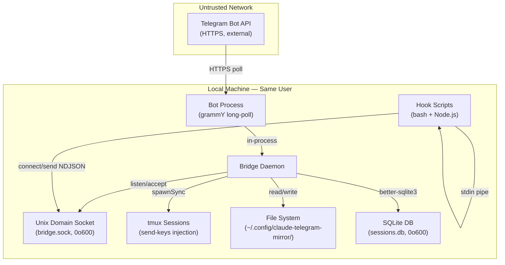

# Security Policy

## Threat Model

The claude-telegram-mirror bridges a local Claude Code CLI session to a remote
Telegram chat. The system has five trust boundaries, shown below.

### Trust boundaries

| Boundary | Trust level | Threat |
|----------|-------------|--------|
| Telegram Bot API to Bot process | Untrusted network | Spoofed updates, message injection from unauthorized chats |
| Unix domain socket (bridge.sock) | Same-user local IPC | Other local users or processes connecting |
| tmux send-keys | Same-user process control | Command injection via unsanitized text |
| File system (config dir) | Same-user file access | World-readable secrets, path traversal |
| Hook scripts (stdin) | Subprocess execution | Oversized payloads, malformed JSON |

## Security Mitigations

### 1. No Shell Interpolation in tmux Injection

**File:** `src/bridge/injector.ts`

All tmux commands use `spawnSync()` with argument arrays. The process binary
is the first argument and all subsequent arguments are passed directly to the
kernel without shell interpretation. The `-l` (literal) flag on `send-keys`
ensures tmux treats the injected string as literal keystrokes. No escaping or
quoting is needed.

Dead code for FIFO and PTY injection methods has been removed. The only
injection method is `tmux`. See [ADR-004](docs/adr/ADR-004-tmux-only-injection.md).

Slash commands (e.g., `/clear`, `/rename`) are validated against a character
whitelist (`[a-zA-Z0-9_- /]`) before injection. Commands containing shell
metacharacters are rejected.

### 2. Bot Token Scrubbing

**File:** `src/utils/logger.ts`

A winston format plugin applies `scrubBotToken()` to every log message and
every string-valued metadata field. The regex
`/bot\d+:[A-Za-z0-9_-]+\//g` matches the Telegram bot token pattern in API
URLs and replaces it with `bot<REDACTED>`.

All log output goes to stderr via the Console transport with
`stderrLevels` set to all levels. There is no file transport, so tokens
cannot leak into log files on disk.

The error handler in `src/bot/telegram.ts` also calls `scrubBotToken()`
on error messages before passing them to the logger.

### 3. Chat Authorization (Anti-IDOR)

**File:** `src/bot/telegram.ts`

A grammY middleware checks `ctx.chat.id` against the configured `chatId` on
every incoming update. Updates from unauthorized chats receive a static
"Unauthorized" reply and are not processed further.

**File:** `src/bot/commands.ts`

Approval callback handlers (`approve:`, `reject:`, `abort:`), answer
handlers (`answer:`, `toggle:`, `submit:`), all verify `ctx.chat.id`
matches the configured `configChatId` before processing. This prevents
IDOR attacks where a user who knows an approval ID could respond from a
different chat.

### 4. Session ID Validation

**File:** `src/bridge/daemon.ts`

Session IDs from hook events are validated before any database operation:
- Maximum length: 128 characters
- Character set: `[a-zA-Z0-9_-]` only
- Empty/null values are rejected

Messages with invalid session IDs are dropped with a warning log.

### 5. Socket Security

**File:** `src/bridge/socket.ts`

The socket server enforces three limits:
- **NDJSON line limit:** 1 MiB (1,048,576 bytes) per line. Oversized lines
  are dropped and logged.
- **Connection limit:** 64 concurrent connections. New connections beyond
  this limit are destroyed immediately.
- **Directory permissions:** The socket directory is created with mode 0o700
  (owner-only) and the socket file is set to 0o600 after binding.

A PID file lock prevents multiple daemon instances from racing on the same
socket.

### 6. Socket Path Validation

**File:** `src/utils/config.ts`

`validateSocketPath()` rejects socket paths that:
- Contain `..` (directory traversal)
- Are not absolute (do not start with `/`)
- Exceed 256 characters

Invalid paths fall back to the default socket path in the config directory.

### 7. Config Directory Permissions

**File:** `src/utils/config.ts`

`ensureConfigDir()` creates `~/.config/claude-telegram-mirror/` with mode
0o700. If the directory already exists, it enforces 0o700 via `chmodSync()`.
All config directory creation goes through this single function.

### 8. Database File Permissions

**File:** `src/bridge/session.ts`

Immediately after opening the SQLite database, `chmodSync(dbPath, 0o600)` is
called to ensure the database file is owner-readable/writable only.

### 9. Hook Stdin Size Limit

**File:** `src/hooks/handler.ts`

The Node.js hook handler reads stdin in chunks and enforces a 1 MiB
(1,048,576 byte) limit. If the accumulated input exceeds this limit, the
handler logs a warning and exits cleanly without processing the payload.

### 10. Download File Handling

**File:** `src/bridge/daemon.ts`

Downloaded files from Telegram are handled with several protections:
- The downloads directory is created with mode 0o700
- Downloaded files are written with mode 0o600
- Filenames are sanitized: path separators replaced, `..` removed, dotfile
  prefixes neutralized, length capped at 200 characters
- Every filename is prefixed with a UUID for uniqueness
- Files older than 24 hours are automatically cleaned up
- Telegram enforces a 20 MB file size limit at the API level

## File Permission Summary

| File/Directory | Mode | Rationale |
|---|---|---|
| `~/.config/claude-telegram-mirror/` | 0o700 | Contains bot token in config, session database, socket |
| `config.json` | 0o600 | Contains bot token |
| `sessions.db` | 0o600 | Contains session metadata, approval records |
| `bridge.sock` | 0o600 | IPC socket, same-user access only |
| `bridge.pid` | default | PID lock file, no sensitive content |
| `downloads/` | 0o700 | User-uploaded files from Telegram |
| Downloaded files | 0o600 | User-uploaded content, owner-only |

## Input Validation Summary

| Boundary | Validation | Enforcement |
|---|---|---|
| Socket messages: session ID | 128 char max, `[a-zA-Z0-9_-]` | `daemon.ts` — `isValidSessionId()` |
| Socket lines | 1 MiB max per NDJSON line | `socket.ts` — `MAX_LINE_BYTES` |
| Socket connections | 64 concurrent max | `socket.ts` — `MAX_CONNECTIONS` |
| Hook stdin | 1 MiB max | `handler.ts` — `MAX_STDIN_BYTES` |
| Socket paths | No `..`, absolute only, 256 char max | `config.ts` — `validateSocketPath()` |
| Slash commands | Character whitelist: `[a-zA-Z0-9_- /]` | `injector.ts` — `isValidSlashCommand()` |
| Download filenames | Sanitized, UUID-prefixed, no `..`, 200 char max | `daemon.ts` — `sanitizeFilename()` |
| Download file size | 20 MB max | Telegram Bot API server-side limit |
| Telegram chat ID | Exact match against configured `chatId` | `telegram.ts` middleware, `commands.ts` callbacks |

## Security Checklist for Contributors

Before modifying security-sensitive code, verify:

- [ ] **No shell interpolation.** All subprocess calls use `spawnSync()` or
  `execSync()` with argument arrays, never string concatenation into a shell
  command.
- [ ] **No hardcoded secrets.** Bot tokens come from environment variables or
  the config file, never from source code.
- [ ] **File permissions enforced.** Any new file or directory in the config
  directory uses 0o600 (files) or 0o700 (directories).
- [ ] **Input validated at boundary.** Any data arriving from the socket, stdin,
  or Telegram is validated before use. Session IDs, file paths, and command
  strings are checked against their respective whitelists.
- [ ] **Bot token not logged.** Any error message that might contain a URL is
  passed through `scrubBotToken()` before logging.
- [ ] **Chat ID checked.** Any new callback handler or message handler verifies
  `ctx.chat.id` matches the configured `chatId`.
- [ ] **Tests pass.** Run `npm test` and confirm no regressions.
- [ ] **No new file logging.** All log output goes to stderr. Do not add file
  transports to the logger.
- [ ] **Path traversal blocked.** Any user-controlled path component is
  validated to reject `..` and non-absolute paths.

## Responsible Disclosure

If you discover a security vulnerability in claude-telegram-mirror, please
report it responsibly:

1. **Do not** open a public GitHub issue for security vulnerabilities.
2. Email the maintainers at the address listed in `package.json`, or use
   GitHub's private vulnerability reporting feature on the repository.
3. Include a description of the vulnerability, steps to reproduce, and the
   potential impact.
4. Allow up to 90 days for a fix before public disclosure.

We will acknowledge receipt within 48 hours and aim to release a fix within
30 days of confirmation.
