# Architecture Guide

## System Overview

Claude Code Rust Telegram (CTM) is a bidirectional bridge between Claude Code CLI sessions and Telegram. It captures Claude Code hook events, forwards them to Telegram, and injects Telegram replies back into the CLI via tmux.

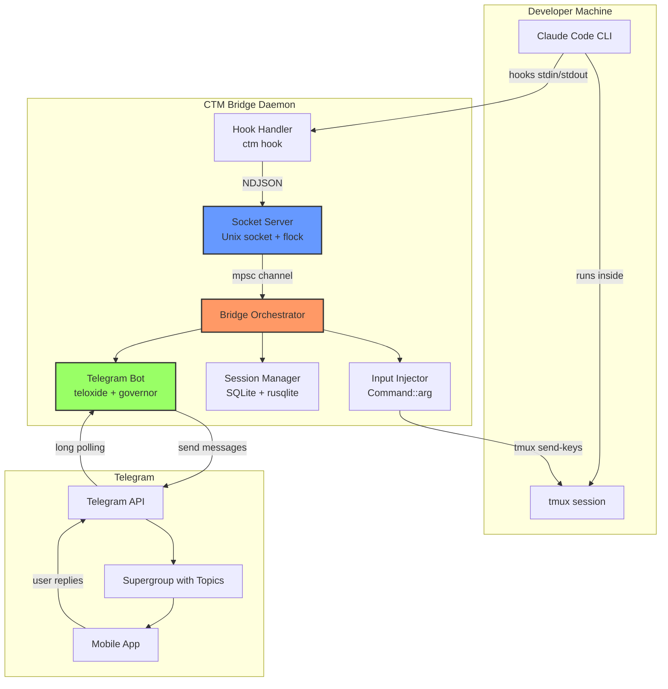

## Module Dependency Graph

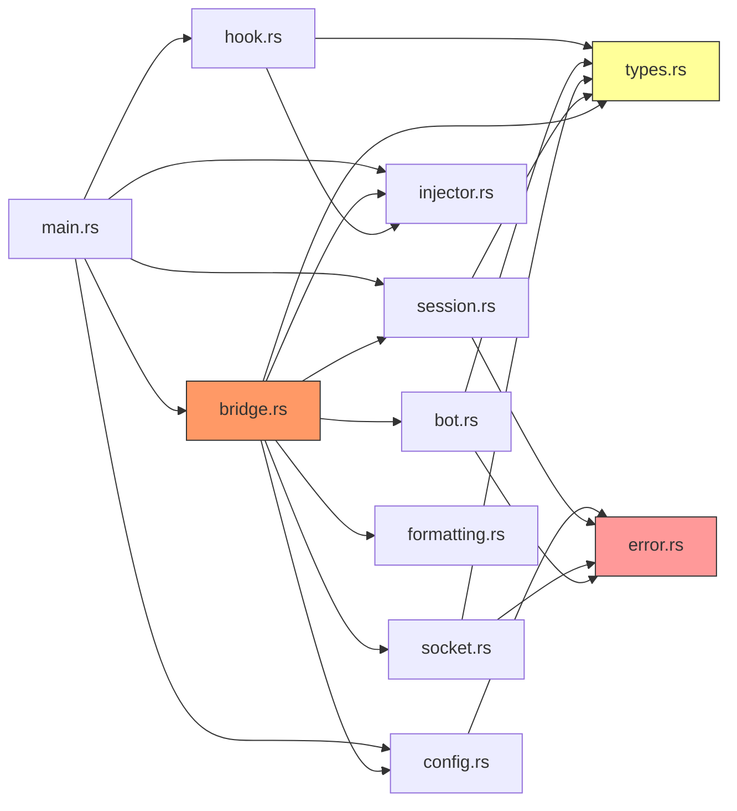

## Message Flow

### CLI to Telegram (Outbound)

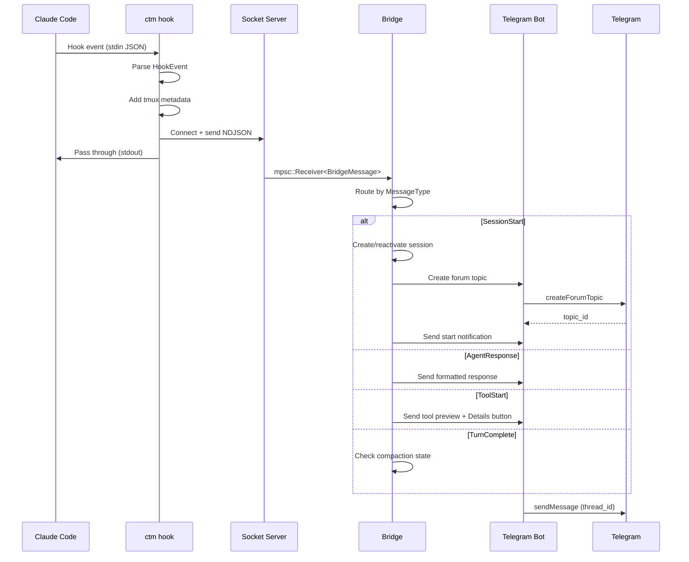

### Telegram to CLI (Inbound)

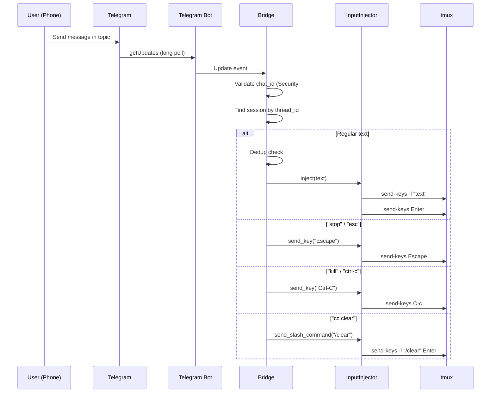

### Tool Approval Flow

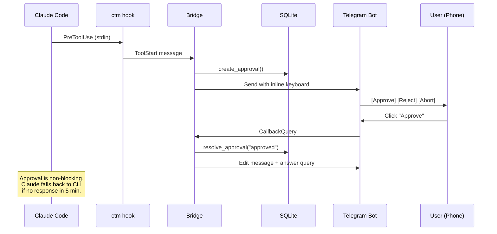

## Session Lifecycle

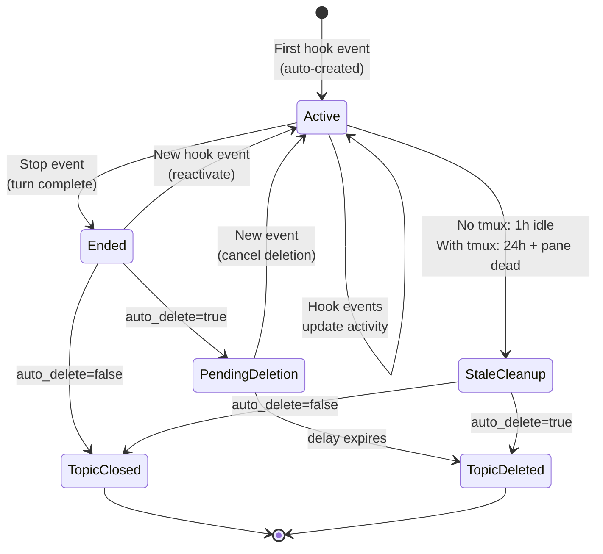

## Socket Protocol

CTM uses **NDJSON** (Newline-Delimited JSON) over a Unix domain socket:

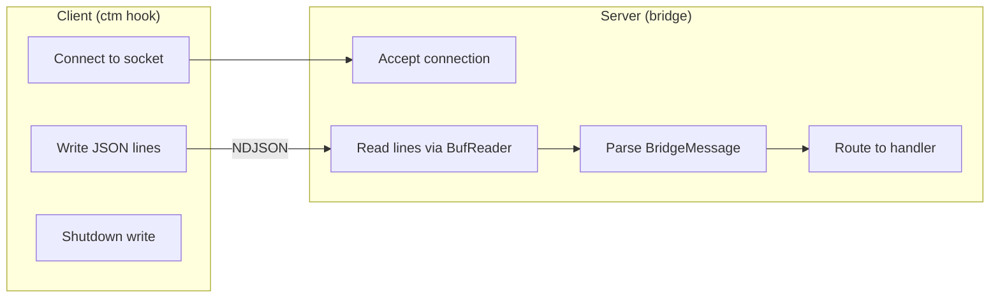

### BridgeMessage Format

```json
{
  "msgType": "tool_start",
  "sessionId": "session-abc123",
  "timestamp": "2025-01-15T10:30:00Z",
  "content": "Tool: Bash",
  "metadata": {
    "tool": "Bash",
    "input": { "command": "cargo test" },
    "tmuxTarget": "workspace:0.0",
    "hostname": "dev-machine"
  }
}
```

### Message Types

| Type | Direction | Description |
|------|-----------|-------------|
| `session_start` | CLI -> TG | New session detected |
| `session_end` | CLI -> TG | Session terminated |
| `agent_response` | CLI -> TG | Claude's text response |
| `tool_start` | CLI -> TG | Tool execution beginning |
| `tool_result` | CLI -> TG | Tool output (verbose mode) |
| `user_input` | CLI -> TG | User typed in CLI |
| `approval_request` | CLI -> TG | Tool needs approval |
| `error` | CLI -> TG | Error notification |
| `turn_complete` | CLI -> TG | Claude finished a turn |
| `pre_compact` | CLI -> TG | Context compaction starting |

## Security Architecture

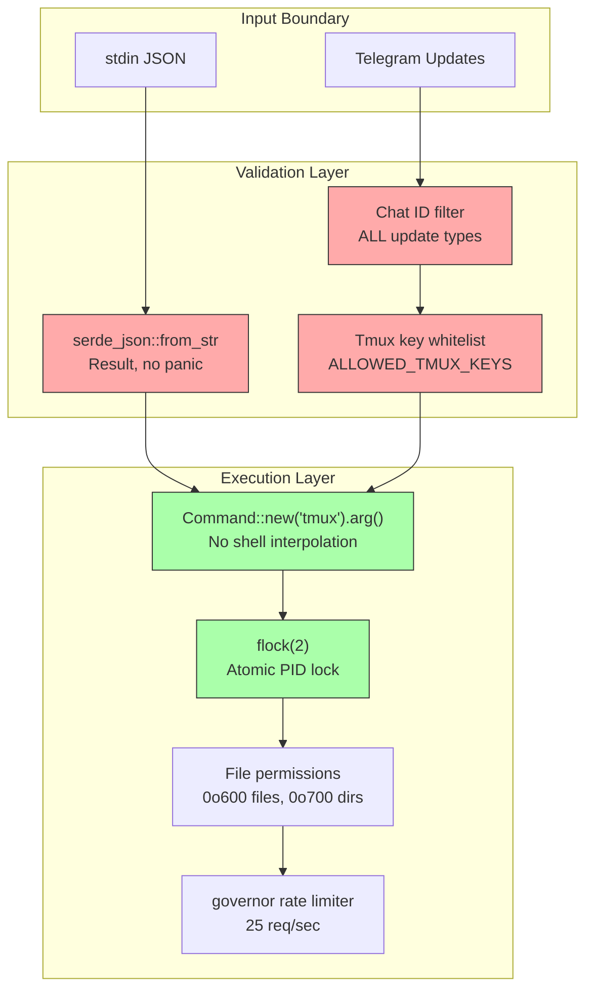

### Vulnerability Matrix

| # | Severity | Vulnerability | Fix |
|---|----------|--------------|-----|
| 1 | CRITICAL | Command injection in tmux slash commands | `Command::new("tmux").arg()` |
| 2 | CRITICAL | FIFO path shell interpolation | Eliminated entirely |
| 3 | CRITICAL | World-readable config/secrets | `OpenOptions::mode(0o600)` |
| 4 | HIGH | Logs in world-readable /tmp | Logs in config dir with 0o600 |
| 5 | HIGH | Chat ID bypass on callbacks | Filter on ALL update types |
| 6 | HIGH | Config dir insecure permissions | `mkdir` + `chmod 0o700` |
| 7 | HIGH | tmux target interpolation | Passed as `.arg()` only |
| 8 | MEDIUM | TOCTOU race in PID locking | `flock(2)` atomic lock |
| 9 | MEDIUM | No input rate limiting | `governor` token-bucket |
| 10 | MEDIUM | Panic on malformed JSON | `serde_json` returns `Result` |

## Concurrency Model

```mermaid
graph TB
    subgraph "Main Thread"
        START[bridge.start()]
        START --> SPAWN
    end

    subgraph "Spawned Tasks (tokio::spawn)"
        SPAWN --> SOCKET_TASK[Socket Handler<br/>while msg_rx.recv()]
        SPAWN --> POLL_TASK[Telegram Poller<br/>get_updates loop]
        SPAWN --> CLEANUP_TASK[Cleanup Timer<br/>every 5 minutes]
    end

    subgraph "Shared State (Arc)"
        SESSIONS["Arc&lt;Mutex&lt;SessionManager&gt;&gt;"]
        INJECTOR["Arc&lt;Mutex&lt;InputInjector&gt;&gt;"]
        THREADS["Arc&lt;RwLock&lt;HashMap&gt;&gt;<br/>session -> thread_id"]
        TARGETS["Arc&lt;RwLock&lt;HashMap&gt;&gt;<br/>session -> tmux_target"]
        CACHE["Arc&lt;RwLock&lt;HashMap&gt;&gt;<br/>tool input cache"]
    end

    SOCKET_TASK --> SESSIONS
    SOCKET_TASK --> THREADS
    SOCKET_TASK --> TARGETS
    SOCKET_TASK --> CACHE
    POLL_TASK --> SESSIONS
    POLL_TASK --> INJECTOR
    POLL_TASK --> THREADS
    CLEANUP_TASK --> SESSIONS
    CLEANUP_TASK --> THREADS

    style SESSIONS fill:#69f,stroke:#333
    style INJECTOR fill:#69f,stroke:#333
```

### Task Communication

| Channel | Type | Purpose |
|---------|------|---------|
| `msg_rx` | `mpsc::Receiver<BridgeMessage>` | Socket -> Bridge (incoming hook events) |
| `broadcast_tx` | `broadcast::Sender<BridgeMessage>` | Bridge -> Socket clients (outgoing) |

## Database Schema

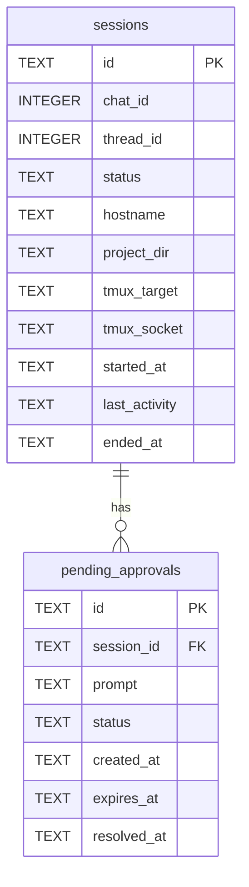

## Configuration Priority

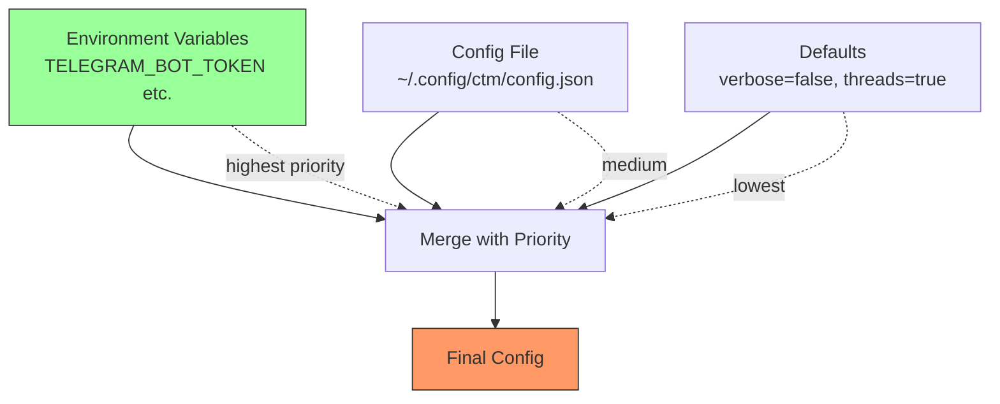

## Forum Topic Management

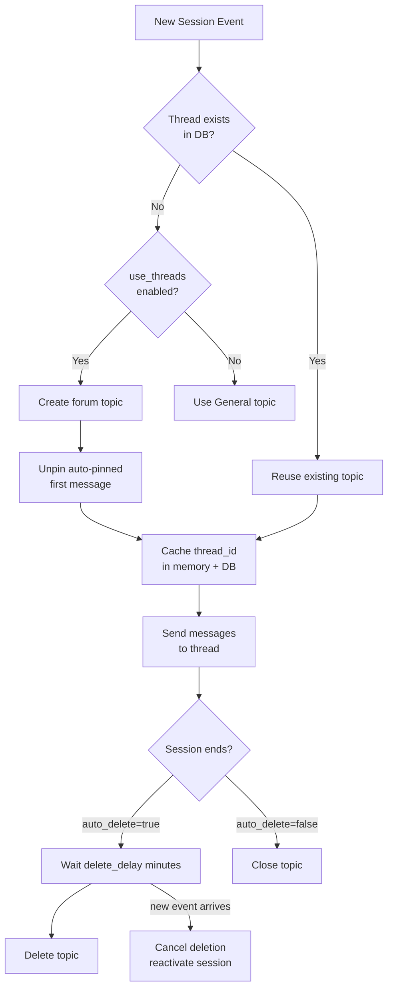
