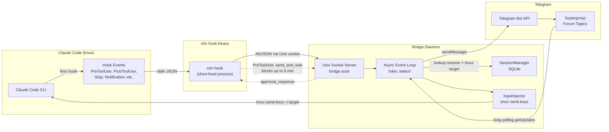

# Claude Telegram Mirror -- Architecture

A bidirectional bridge between Claude Code CLI sessions and Telegram, written in Rust. The system mirrors Claude Code activity to Telegram forum topics and routes Telegram replies back into the CLI via tmux.

## 1. System Overview



**Outbound (CLI to Telegram):** Claude Code fires hook events on tool use, completions, notifications, and prompts. Each event invokes the `ctm hook` binary, which reads the JSON event from stdin, converts it to one or more `BridgeMessage` structs, and writes them as NDJSON lines over a Unix domain socket. The bridge daemon receives these messages via a `tokio::sync::broadcast` channel, routes them to the correct Telegram forum topic, and sends them through the Bot API.

**Inbound (Telegram to CLI):** The daemon long-polls Telegram for updates. When a user replies in a forum topic, the daemon looks up the associated session in SQLite, resolves the tmux target and socket path, and injects the text into the correct tmux pane using `tmux send-keys`.

**Approval workflow (PreToolUse):** For tools that require permission (Write, Edit, Bash with non-safe commands), the hook binary sends an `approval_request` message and blocks on the socket waiting for a correlated `approval_response`. The daemon presents inline keyboard buttons in Telegram. When the user taps Approve, Reject, or Abort, the daemon writes the response back to the hook's socket connection. The hook returns a `hookSpecificOutput` JSON to Claude Code with the permission decision. Timeout is 5 minutes; connection-refused means the daemon is not running, so the hook returns `None` and Claude continues normally.

## 2. Module Structure

The crate lives at `rust-crates/ctm/` and compiles to both a binary (`main.rs`) and a library (`lib.rs`). There are 30 source files across 14 top-level modules and three sub-module groups (`bot/`, `daemon/`, `service/`).

### Top-level modules

**main.rs** -- Binary entry point. Defines the `clap` CLI with subcommands (`hook`, `start`, `stop`, `restart`, `status`, `config`, `install-hooks`, `uninstall-hooks`, `hooks`, `setup`, `doctor`, `service`, `toggle`). Initializes the `tracing` subscriber with a custom `ScrubWriter` that strips Telegram bot tokens from all log output before it reaches stderr. Handles SIGINT and SIGTERM via `tokio::signal` for graceful async shutdown.

**lib.rs** -- Library re-exports. Makes all modules public so downstream Rust consumers can depend on the crate (e.g., `use ctm::session::SessionManager`).

**config.rs** -- Configuration loading with three-tier priority: environment variables, then `~/.config/claude-telegram-mirror/config.json` (supporting both camelCase and snake_case keys via serde aliases), then compiled defaults. Validates socket paths against traversal attacks. Manages the runtime `status.json` file for the mirroring toggle. Ensures the config directory exists with `0o700` permissions.

**error.rs** -- Centralized error types using `thiserror`. Defines `AppError` with variants for Config, IO, JSON, Socket, Injection, Hook, Database, Lock, Telegram, and Reqwest errors. All public functions return `Result<T, AppError>`.

**types.rs** -- Shared data types. Defines `HookEvent` (a tagged enum deserialized from Claude Code's JSON, with variants for Stop, SubagentStop, PreToolUse, PostToolUse, Notification, UserPromptSubmit, and PreCompact), `BridgeMessage` (the NDJSON wire format sent over the Unix socket), `MessageType` (an enum with a forward-compatible `Unknown` catch-all via `#[serde(other)]`), and `HookResult`. Also defines validation functions (`is_valid_session_id`, `is_valid_slash_command`) and security constants (`SAFE_COMMANDS`, `ALLOWED_TMUX_KEYS`, `MAX_SESSION_ID_LEN`, `MAX_LINE_BYTES`).

**hook.rs** -- Hook event processing, the entry point for `ctm hook`. Reads stdin with a 1 MiB size limit, parses the JSON into a `HookEvent`, validates the session ID, detects the current tmux session from `$TMUX`, and builds one or more `BridgeMessage` values. For `PreToolUse` events that require approval, it calls `send_and_wait` to block on the socket for up to 5 minutes. For `Stop` events, it extracts the transcript summary or falls back to reading the JSONL transcript file. Always sends a `session_start` message first (the daemon deduplicates).

**injector.rs** -- Input injection via tmux. All tmux commands use `Command::arg()` with no shell interpolation, preventing command injection. Validates tmux socket paths (must be absolute, no `..`, max 256 chars). Provides `inject()` (text with `-l` literal flag + Enter), `send_key()` (from a whitelist of safe keys), and `send_slash_command()` (character-validated). Includes `detect_tmux_session()` which reads `$TMUX` and queries tmux for session/window/pane, and `find_claude_code_session()` as a fallback that searches running pane commands.

**session.rs** -- SQLite-backed session and approval manager. Uses `rusqlite` with file permissions set to `0o600`. Schema has two tables: `sessions` (with columns for id, chat_id, thread_id, hostname, tmux_target, tmux_socket, started_at, last_activity, status, project_dir, metadata) and `pending_approvals` (with expiry tracking). Supports session creation, reactivation, thread ID management, tmux info storage, stale candidate queries, orphaned thread detection, and approval lifecycle (create, resolve, expire). Uses ISO 8601 TEXT timestamps for human-readable SQLite queries. Includes automatic schema migration for tmux columns.

**socket.rs** -- Unix domain socket server and client with NDJSON framing. The server uses `flock(2)` on the PID file for atomic single-instance enforcement (no TOCTOU race). After `bind()`, applies `chmod(0o600)` to the socket file (ADR-009: replaced the previous `umask(0o177)` approach which was process-global and caused race conditions in multi-threaded contexts). Ensures the parent directory is `0o700`. Supports up to 64 concurrent connections. Each client is handled in a spawned tokio task that reads NDJSON lines and broadcasts them via `tokio::sync::broadcast`. The client side provides `connect`, `send`, `send_and_wait` (with timeout and session ID correlation), and `disconnect`.

**bot/ (module)** -- Telegram Bot API client. Split into three sub-modules: `client.rs` (the `TelegramBot` struct with HTTP API methods for sending messages, managing forum topics, editing messages, downloading/uploading files, long polling, and callback query handling), `queue.rs` (message queue with rate limiting via `governor` clamped to `[1, 30]` msgs/sec (ADR-009), bounded to `MAX_QUEUE_SIZE = 500` messages with oldest-eviction, retry with overflow-safe exponential backoff using `saturating_mul`, TOPIC_CLOSED recovery, and entity parse error fallback to plain text), and `types.rs` (Telegram API response types including `Update`, `TgMessage`, `CallbackQuery`, `InlineButton`, etc.). Bot token scrubbing uses a compiled regex `bot\d+:[A-Za-z0-9_-]+/` applied globally to all error messages.

**daemon/ (module)** -- The bridge daemon, the central orchestrator. Split into six sub-modules: `mod.rs` (the `Daemon` struct with `start()`/`stop()`, shared state in `Arc<RwLock<...>>` and `Arc<Mutex<...>>`, the `HandlerContext` passed to all handlers, documented lock ordering to prevent deadlocks, `ensure_session_exists` with atomic topic creation locks, and echo prevention via null-separated keys (ADR-009)), `event_loop.rs` (the main `tokio::select!` loop multiplexing socket messages, Telegram long-polling updates, and a 5-minute cleanup timer), `socket_handlers.rs` (handlers for each `MessageType`: session start/end, agent response, tool start/result, approval request, user input, error, pre-compact, session rename, commands, and image sending), `telegram_handlers.rs` (handlers for Telegram messages and inline commands like /status, /help, /mute, /attach, /abort, /toggle, /ping, /sessions), `callback_handlers.rs` (handlers for inline keyboard callbacks: approval responses, tool detail expansion, and AskUserQuestion multi-select), `cleanup.rs` (stale session detection with differentiated timeouts, topic deletion with configurable delay, download directory cleanup, and state file cleanup for `.last_line_*` files (ADR-009)), and `files.rs` (file download handling for photos and documents sent from Telegram).

**formatting.rs** -- Message formatting and chunking for Telegram display. ANSI escape stripping, MarkdownV2 escaping (code-block aware), message chunking that respects code block boundaries and uses natural break points (paragraph, line, sentence, word), tool-specific detail formatting for 10+ tool types, heuristic language detection for code blocks, and path truncation. The chunker adds "Part N/M" headers to multi-part messages.

**summarize.rs** -- Human-readable one-liner summaries for tool actions. Maps tool names and inputs to descriptions like "Building project", "Running tests", "Editing .../src/file.rs". Handles 30+ Bash command patterns (cargo, git, npm, yarn, pnpm, bun, pip, pytest, docker, make, go, etc.), strips wrapper commands (sudo, nohup, timeout, env, nice), and skips trivial prefixes (cd, export, echo) in chained commands.

**installer.rs** -- Hook installer that programmatically modifies Claude Code's `settings.json`. Supports both global (`~/.claude/settings.json`) and project-level (`.claude/settings.json`) installation. Installs hooks for 6 event types: PreToolUse (with 310-second timeout for approval workflow), PostToolUse, Notification, Stop, UserPromptSubmit, and PreCompact. Idempotent: detects existing CTM hooks by command pattern matching, preserves non-CTM hooks, and reports Added/Updated/Unchanged status per hook type.

**service/ (module)** -- OS service management for systemd (Linux) and launchd (macOS). Split into four sub-modules: `mod.rs` (platform detection, public API for install/uninstall/start/stop/restart/status, the `ServiceAction` clap enum), `systemd.rs` (generates and manages `~/.config/systemd/user/claude-telegram-mirror.service`), `launchd.rs` (generates and manages `~/Library/LaunchAgents/com.claude.claude-telegram-mirror.plist` with XML escaping), and `env.rs` (parses `~/.telegram-env` for service environment variables).

**setup.rs** -- Interactive setup wizard using the `dialoguer` crate. Guides users through 8 steps: bot token configuration, chat ID discovery, environment variable setup, hook installation, service configuration, and connectivity testing.

**doctor.rs** -- Diagnostic checker with optional `--fix` auto-remediation. Validates configuration completeness, socket status, service health, hook installation, file permissions, and Telegram connectivity. Reports results as Pass/Warn/Fail with actionable fix suggestions.

**colors.rs** -- ANSI color helper functions (green, red, yellow, cyan, gray, bold) for terminal output. Centralized from duplicated code in doctor.rs and setup.rs.

## 3. Binary Distribution

The Rust binary is distributed through npm using a platform-specific optional dependency pattern.

```
@agidreams/ctm (main package)
  |
  +-- scripts/ctm-wrapper.cjs     # Entry point (npm "bin" field)
  |     Tries native binary first, falls back to local dev build.
  |
  +-- scripts/resolve-binary.cjs  # Binary resolution logic
  |     Maps os.platform()+os.arch() to package name.
  |     Searches node_modules for the platform package.
  |
  +-- optionalDependencies:
        @agidreams/ctm-linux-x64    # x86_64 Linux (glibc)
        @agidreams/ctm-linux-arm64  # aarch64 Linux (glibc)
        @agidreams/ctm-darwin-arm64 # Apple Silicon macOS
        @agidreams/ctm-darwin-x64   # Intel macOS
```

Each platform package contains a single pre-compiled `ctm` binary. The wrapper script (`ctm-wrapper.cjs`) resolves the correct binary at runtime. If no native binary is found (unsupported platform or install failure), the wrapper falls back to a local Rust build in `rust-crates/target/release/ctm`.

## 4. Communication Flow

### CLI to Telegram path

1. Claude Code fires a hook event (e.g., PostToolUse) and invokes `ctm hook` via the command configured in `settings.json`.
2. `ctm hook` reads the JSON event from stdin (size-limited to 1 MiB), parses it as a `HookEvent`, and validates the `session_id`.
3. The hook detects the current tmux session from `$TMUX` and resolves the hostname.
4. `build_messages()` constructs a batch of `BridgeMessage` values. A `session_start` message is always included first (the daemon deduplicates). The specific message types depend on the event: `tool_start` for PreToolUse, `tool_result` for PostToolUse, `agent_response`/`turn_complete`/`session_end` for Stop, `user_input` for UserPromptSubmit, etc.
5. The messages are serialized as NDJSON and written to the Unix socket at `~/.config/claude-telegram-mirror/bridge.sock`.
6. The daemon's socket server reads the lines, deserializes them as `BridgeMessage`, and broadcasts them to the `tokio::sync::broadcast` channel.
7. The event loop receives the broadcast and spawns a handler task.
8. `handle_socket_message()` validates the session ID, updates activity timestamps, auto-refreshes the tmux target if changed, checks the mirroring toggle, and dispatches to the appropriate handler.
9. `ensure_session_exists()` creates the session and forum topic on-the-fly if this is the first event for this session. A `TopicCreationState` with a `tokio::sync::Notify` prevents duplicate topics from concurrent events.
10. The handler formats the message using `formatting.rs` and `summarize.rs`, then sends it via the `TelegramBot` to the correct forum topic.

### Telegram to CLI path

1. The daemon's event loop calls `bot.get_updates()` with long polling (30-second timeout).
2. When a message arrives, `handle_telegram_message()` checks if the message is in a forum topic (has `message_thread_id`), looks up the session by thread ID, and determines the tmux target.
3. Special commands (/status, /help, /mute, /attach, /abort, /toggle, /ping, /sessions, /compact, /clear, /rename) are handled directly.
4. Interrupt commands (stop, cancel, escape) send the Escape key; kill commands (kill, exit, ctrl-c) send C-c.
5. Regular text is injected via `InputInjector::inject()`, which calls `tmux send-keys -t <target> -l <text>` followed by `tmux send-keys -t <target> Enter`. The `-l` flag ensures literal mode (no tmux key interpretation).
6. An echo key is added to `recent_telegram_inputs` with a 10-second TTL to suppress the echoed message when it comes back through the hook.

### Approval workflow

1. A PreToolUse hook event arrives for a tool that requires approval (Write, Edit, MultiEdit, or Bash with a non-safe first command).
2. The hook sends an `approval_request` message to the daemon and calls `send_and_wait()`, which blocks on the socket reading NDJSON lines until a matching `approval_response` arrives or 5 minutes elapse.
3. The daemon creates a `PendingApproval` row in SQLite, formats the approval prompt with tool details, and sends it to Telegram with inline keyboard buttons (Approve, Reject, Abort Session).
4. When the user taps a button, `handle_callback_query()` resolves the approval, writes the response back to the hook's socket connection, edits the Telegram message to show the decision, and answers the callback query.
5. The hook receives the response and returns the appropriate `hookSpecificOutput` JSON to Claude Code: `permissionDecision: "allow"`, `"deny"`, or `"ask"` (fallback to CLI approval on timeout).

## 5. Session Lifecycle

### Creation

Sessions are created lazily via `ensure_session_exists()`, called by every message handler. There is no requirement for an explicit `session_start` message to precede other events. When the first event arrives for a new session ID:

1. The daemon checks SQLite for an existing session. If found and active, it returns immediately.
2. If found but ended/aborted, the session is reactivated (status set to `active`, activity timestamp updated). Any pending topic deletion is cancelled.
3. If not found, a topic creation lock is acquired (using `tokio::sync::Notify`) and `handle_session_start()` creates both the SQLite row and the Telegram forum topic atomically.

### Active

While active, every hook event updates the session's `last_activity` timestamp. The tmux target is auto-refreshed on every message if the hook reports a different target (handles the case where Claude moves to a different pane).

### Stale cleanup

The daemon runs a cleanup sweep every 5 minutes. Stale session detection uses differentiated timeouts:

- **Sessions with tmux info:** Candidates are sessions whose `last_activity` is older than 24 hours. For each candidate, the daemon checks if the tmux pane is still alive (`tmux list-panes -t <target>`). If the pane is dead or owned by a different session, the session is ended with a "terminal closed" notification.
- **Sessions without tmux info:** Candidates are sessions whose `last_activity` is older than 1 hour. These sessions have no way to verify liveness, so the shorter timeout is used to avoid accumulating orphans.

### End

When a `session_end` message arrives (from a Stop hook event), the daemon:
1. Marks the session as `ended` in SQLite.
2. Expires all pending approvals for the session.
3. Sends a session-ended notification to the forum topic.
4. Closes the forum topic.
5. Schedules topic deletion after a configurable delay (default 1440 minutes / 24 hours). If a new event arrives for the session before deletion fires, the deletion is cancelled and the session is reactivated.

### Topic deletion with delay

Topic deletion is deferred to allow users to review session history. The delay is configured via `TELEGRAM_TOPIC_DELETE_DELAY_MINUTES` (default: 1440). A `tokio::task::JoinHandle` is stored in `pending_deletions` and can be aborted if the session reactivates. When the delay elapses, the daemon deletes the forum topic and clears the thread ID from the database.

## 6. Security Model

For full details, see `docs/SECURITY.md`. Key security properties of the Rust implementation:

**No shell interpolation.** All subprocess invocations (tmux commands, hostname lookup) use `std::process::Command::arg()`. User-controlled strings (session names, socket paths, message text) are never passed through a shell. This is a structural improvement over shell-based implementations where injection is possible through string interpolation.

**flock(2) for single-instance enforcement.** The socket server acquires an exclusive `flock` on the PID file before binding. This is atomic and avoids the TOCTOU race inherent in checking a PID file's contents. If another daemon holds the lock, startup fails immediately with a clear error.

**Post-bind chmod for socket permissions.** After calling `bind()`, the server applies `chmod(0o600)` to the socket file (owner read/write only). The parent directory is set to `0o700`. This prevents other users on the system from connecting to the socket. (ADR-009: replaced the previous `umask(0o177)` approach, which was per-process and caused race conditions in multi-threaded contexts.)

**Bot token scrubbing.** A global `ScrubWriter` wraps stderr and applies a regex (`bot\d+:[A-Za-z0-9_-]+/`) to all log output before it reaches the terminal or log files. This catches tokens from any source, not just the configured token. The `TelegramBot` struct also scrubs tokens from API error messages.

**Session ID validation.** Session IDs are validated against a strict pattern: non-empty, at most 128 characters, ASCII alphanumerics plus hyphens, underscores, and dots. Invalid IDs are rejected at both the hook and daemon layers.

**Slash command validation.** Commands forwarded from Telegram to the CLI are validated against a character whitelist (ASCII alphanumerics, underscores, hyphens, spaces, and forward slashes). Shell metacharacters (`;`, `|`, `&`, `$`, backticks, etc.) are rejected.

**tmux socket path validation.** Paths must be absolute, must not contain `..`, and must not exceed 256 characters. (Note: the Unix socket path used by the bridge itself is validated against the AF_UNIX `sun_path` limit of 104 bytes (ADR-009), which is more restrictive than the tmux path limit.)

**Secure file permissions.** The config directory is `0o700`. The SQLite database, config.json, and status.json are `0o600`. Downloaded files are written with `0o600`.

**Input size limits.** Hook stdin is limited to 1 MiB. NDJSON lines on the socket are limited to 1 MiB. The socket server accepts at most 64 concurrent connections.

## 7. Concurrency Model

The application uses the tokio async runtime with a multi-threaded executor.

### Event loop

The daemon's main event loop uses `tokio::select!` to multiplex three event sources:

1. **Socket messages** from hook clients, received via `tokio::sync::broadcast::Receiver<BridgeMessage>`. Each message is dispatched to a spawned tokio task for concurrent handling.
2. **Telegram updates** from `bot.get_updates()` long polling. Updates are processed sequentially within each poll cycle but concurrently with socket messages.
3. **Cleanup timer** firing every 5 minutes via `tokio::time::interval`.

### Shared state

The daemon's shared state uses a combination of `Arc<RwLock<T>>` for read-heavy data and `Arc<Mutex<T>>` for write-heavy or externally-synchronized data:

| State | Type | Rationale |
|-------|------|-----------|
| `session_threads` | `Arc<RwLock<HashMap>>` | Read-heavy cache, writes only on topic creation |
| `session_tmux_targets` | `Arc<RwLock<HashMap>>` | Read-heavy, updated on tmux target change |
| `recent_telegram_inputs` | `Arc<RwLock<HashSet>>` | Echo suppression keys with TTL |
| `tool_input_cache` | `Arc<RwLock<HashMap>>` | Cached tool inputs for "Details" button |
| `sessions` (SessionManager) | `Arc<Mutex<SessionManager>>` | SQLite is single-writer; `spawn_blocking` used for I/O |
| `injector` | `Arc<Mutex<InputInjector>>` | tmux target state, infrequent writes |
| `socket_clients` | `Arc<Mutex<HashMap>>` | Client connection map, shared with socket server |

**Lock ordering** is documented in the `HandlerContext` struct to prevent deadlocks: sessions first, then session_threads, then session_tmux, then all other RwLocks in declaration order, then injector, then socket_clients. Most handlers acquire only one lock at a time with short-lived guards.

**SQLite offloading.** The `SessionManager` wraps a synchronous `rusqlite::Connection`. To avoid blocking the tokio runtime, all database operations go through `HandlerContext::db_op()`, which uses `tokio::task::spawn_blocking` to run the operation on tokio's blocking thread pool.

### Rate limiting

The `TelegramBot` uses `governor::RateLimiter` for per-second rate limiting of Telegram API calls. The rate is configurable via `TELEGRAM_RATE_LIMIT` and clamped to `[1, 30]` msgs/sec (ADR-009: Telegram enforces ~30 msgs/sec per bot; unbounded values would trigger 429 errors). The message queue is bounded to `MAX_QUEUE_SIZE = 500` with oldest-message eviction (ADR-009: previously unbounded, risking OOM under sustained send failures). Retry uses overflow-safe exponential backoff with `saturating_mul` (3 retries at 1s/2s/4s intervals) and automatic recovery from TOPIC_CLOSED errors (reopen + retry) and entity parse errors (strip formatting, retry as plain text).

### Signal handling

The binary registers handlers for both SIGINT (Ctrl-C) and SIGTERM using `tokio::signal::unix`. Either signal triggers the same graceful shutdown path: the daemon sends a shutdown notification to Telegram, closes the socket server (which cleans up the socket and PID files), and exits cleanly.

### Mirroring toggle

Runtime toggling of mirroring is implemented via `Arc<AtomicBool>`. The toggle command writes to `status.json` and optionally sends a command through the socket to notify the running daemon. Safety-critical paths (approval requests/responses, commands) always bypass the toggle check.

## 8. Test Suite

The project has 387 tests across unit and integration test suites, with 0 failures and 0 clippy warnings.

### Unit tests

Unit tests are co-located in each source module (30 source files across `src/`). They cover configuration parsing, session management, formatting, summarization, socket communication, error handling, and security validation.

### Integration tests

Eight integration test files live in `rust-crates/ctm/tests/`:

| File | Coverage |
|------|----------|
| `cli_smoke.rs` | Binary invocation, subcommand parsing, `--help` and `--version` output |
| `concurrency.rs` | Multi-threaded socket access, concurrent session operations |
| `config_validation.rs` | Environment variable parsing, config file loading, three-tier priority |
| `formatting_tests.rs` | ANSI stripping, MarkdownV2 escaping, message chunking, path truncation |
| `hook_pipeline.rs` | Hook event parsing, message building, approval workflow plumbing |
| `session_lifecycle.rs` | Session create/end/reactivate, stale cleanup, approval expiry |
| `socket_roundtrip.rs` | Full NDJSON roundtrip through socket server, connection limits, PID locking |
| `summarize_tests.rs` | Tool summarizer coverage for all 30+ command patterns |

### Running tests

```bash
cd rust-crates
cargo test          # All 387 tests
cargo test -- -q    # Quiet output
cargo clippy        # Lint (0 warnings required)
```

## 9. Architecture Decision Records

| ADR | Title | Key changes |
|-----|-------|-------------|
| ADR-008 | v0.2.0 Release Readiness Audit | Structural decomposition (17 -> 30 source files), integration test suite (8 files), binary integrity verification, npm distribution pipeline |
| ADR-009 | Release Polish -- Broken Windows | 19 fixes: umask race elimination, socket path limit (104 bytes), topic creation atomic write lock, rate limiter bounds `[1, 30]`, queue bound (500), overflow-safe backoff, char-count consistency, state file cleanup, duplicate code removal |

Full ADR documents are in `docs/adr/`.
