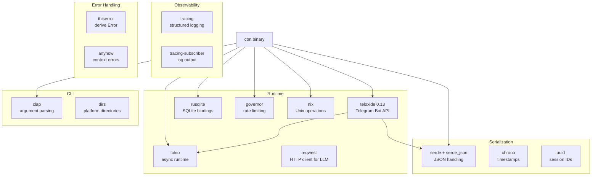
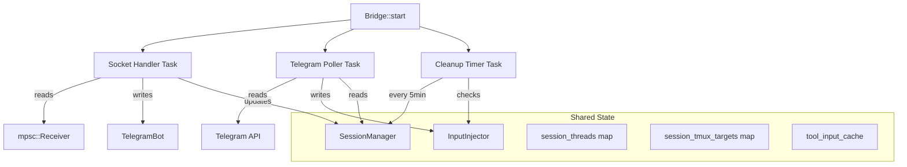
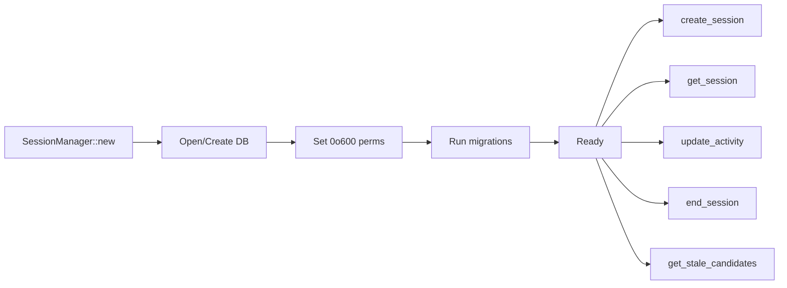

# Development Guide

## Project Structure

```
.
├── Cargo.toml              # Rust dependencies and project config
├── Cargo.lock              # Locked dependency versions
├── src/
│   ├── main.rs             # CLI entrypoint (clap subcommands)
│   ├── bridge.rs           # Central orchestrator
│   ├── bot.rs              # Telegram API wrapper
│   ├── socket.rs           # Unix socket server
│   ├── session.rs          # SQLite session manager
│   ├── hook.rs             # Claude Code hook processor
│   ├── injector.rs         # tmux command injection
│   ├── config.rs           # Configuration loading
│   ├── formatting.rs       # Message formatting + tool summaries
│   ├── summarizer.rs       # LLM-backed fallback summarizer
│   ├── types.rs            # Shared type definitions
│   └── error.rs            # Error types
├── scripts/
│   ├── telegram-hook.sh    # Bash fire-and-forget hook
│   └── get-chat-id.sh      # Helper to find chat IDs
├── docs/
│   ├── PRD.md              # Product requirements
│   ├── ARCHITECTURE.md     # System architecture
│   ├── SETUP.md            # Setup guide
│   ├── DEVELOPMENT.md      # This file
│   ├── SECURITY.md         # Security documentation
│   └── adr/                # Architecture decision records
└── .github/
    └── workflows/
        └── ci.yml          # GitHub Actions CI
```

## Building

```bash
# Debug build (fast compilation, slower binary)
cargo build

# Release build (slow compilation, optimized binary)
cargo build --release

# Check without building
cargo check
```

## Testing

```bash
# Run all tests
cargo test

# Run tests with output
cargo test -- --nocapture

# Run specific test
cargo test test_session_lifecycle

# Run tests for a specific module
cargo test session::tests
```

### Test Coverage

| Module | Tests | What's tested |
|--------|-------|---------------|
| `session.rs` | 3 | CRUD, lifecycle, approvals |
| `socket.rs` | 2 | Server lifecycle, flock double-start prevention |
| `formatting.rs` | 11 | ANSI stripping, truncation, path shortening, tool action summaries (bash/cargo/git, file ops, search, task, unknown), tool result summaries (success, error) |
| `injector.rs` | 2 | Key whitelist validation, no-target safety |
| `config.rs` | 2 | Environment loading, config file defaults |

## Code Quality

```bash
# Lint with clippy
cargo clippy

# Strict mode (deny all warnings)
cargo clippy -- -D warnings

# Format code
cargo fmt

# Check formatting without changing
cargo fmt --all -- --check
```

## Dependency Graph



## Module Deep Dives

### bridge.rs - The Orchestrator

The bridge is the central component that coordinates all others. It spawns three concurrent tokio tasks:



Key patterns:
- `BridgeShared` is a `Clone` struct wrapping all `Arc<Mutex/RwLock>` state
- Session lookup is cached in-memory with DB fallback
- Tool input cache auto-expires after 5 minutes
- Topic deletion is delayed and cancellable
- Tool actions are summarized in natural language via `summarizer.rs` (rule-based, with optional LLM fallback)

### summarizer.rs - Human-Readable Tool Summaries

The summarizer converts raw tool operations into natural language:

| Tool Action | Summary |
|------------|---------|
| `Bash: cargo test` | "Running tests" |
| `Bash: git push` | "Pushing to remote" |
| `Edit: /path/to/config.rs` | "Editing config.rs" |
| `Grep: pattern "auth"` | "Searching for 'auth'" |
| `Task: {desc: "Explore auth"}` | "Delegating: Explore auth" |
| `Unknown: CustomTool` | "Using CustomTool" (LLM fallback if configured) |

Two-tier architecture:
1. **Rule-based** (zero latency): Covers cargo, git, npm, docker, pip, file ops, search, and 15+ system commands
2. **LLM fallback** (optional): When the rule-based summary is generic ("Using X"), calls a configurable LLM endpoint (Anthropic API or Z.AI proxy) for a better summary. Results are cached (200 entries, 5s timeout)

Configuration:
```json
{
  "llm_summarize_url": "https://api.anthropic.com/v1/messages",
  "llm_api_key": "sk-ant-..."
}
```
Or via environment: `CTM_LLM_SUMMARIZE_URL`, `CTM_LLM_API_KEY`

### injector.rs - Shell-Safe Command Execution

The injector is the most security-critical module. Every tmux command uses `Command::new("tmux").arg()`:

```rust
// SAFE: arguments are passed as separate args, never interpolated
fn run_tmux(&self, args: &[&str]) -> Result<bool> {
    let mut cmd = std::process::Command::new("tmux");
    if let Some(socket) = &self.socket_path {
        cmd.arg("-S").arg(socket);
    }
    for arg in args {
        cmd.arg(arg);
    }
    // ...
}
```

Compare with the vulnerable TypeScript version:
```typescript
// UNSAFE: string interpolation allows injection
execSync(`tmux send-keys -t ${target} "${text}" Enter`);
```

### session.rs - SQLite with rusqlite

Sessions and approvals are stored in SQLite with bundled SQLite3:



## Adding a New Hook Event Type

1. Add variant to `HookEvent` enum in `types.rs`:
```rust
#[serde(rename = "NewEvent")]
NewEvent {
    session_id: String,
    #[serde(default)]
    custom_field: Option<String>,
},
```

2. Handle in `hook.rs` `event_to_bridge_messages()`:
```rust
HookEvent::NewEvent { custom_field, .. } => {
    vec![BridgeMessage { ... }]
}
```

3. Add routing in `bridge.rs` `handle_socket_message()`:
```rust
MessageType::NewType => self.handle_new_type(&msg).await?,
```

## Adding a New Telegram Command

1. Add handler in `bridge.rs` `handle_telegram_command()`:
```rust
"/mycommand" => {
    let _ = self.bot.send_message("Response", &SendOptions::default(), thread_id).await;
}
```

## Debugging

```bash
# Enable debug logging
RUST_LOG=debug ctm start

# Enable trace logging (very verbose)
RUST_LOG=trace ctm start

# Filter to specific module
RUST_LOG=ctm::bridge=debug ctm start
```

## Release Build Optimization

The release profile in `Cargo.toml`:

```toml
[profile.release]
opt-level = 3    # Maximum optimization
lto = true       # Link-time optimization
strip = true     # Strip debug symbols
```

This produces a small, fast binary (~5-10MB vs ~50MB debug).
