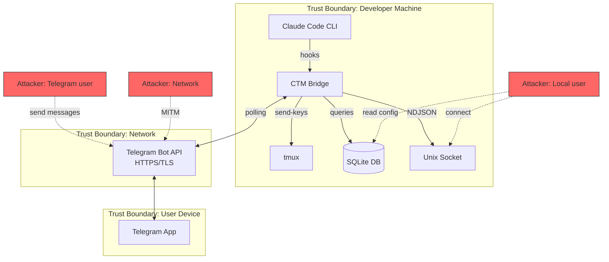
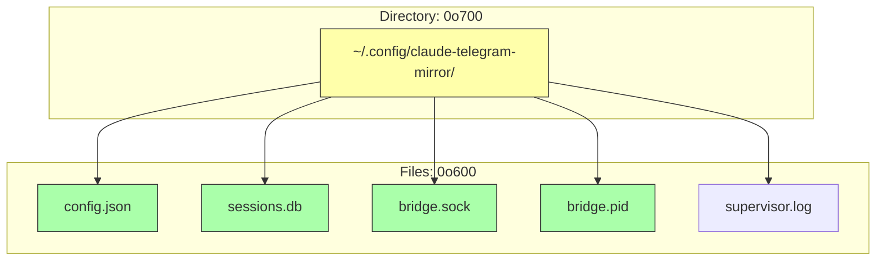

# Security Documentation

## Threat Model



### Attack Surfaces

| Surface | Risk | Mitigation |
|---------|------|-----------|
| Unix socket | Local user connects | 0o600 permissions, flock PID |
| Config file | Token theft | 0o600 permissions |
| Telegram API | Unauthorized commands | Chat ID validation on ALL updates |
| tmux injection | Command injection | `Command::arg()`, key whitelist |
| JSON parsing | Denial of service | `serde_json` Result handling, no panics |
| PID file | Race condition | `flock(2)` atomic locking |
| Rate limiting | API abuse | `governor` token-bucket per bot |

## Vulnerability Fixes

### CRITICAL-1: Command Injection in tmux Slash Commands

**Before (TypeScript):**
```typescript
// VULNERABLE: User input interpolated into shell command
execSync(`tmux send-keys -t ${target} "${userInput}" Enter`);
// Input: `"; rm -rf / #` -> executes arbitrary commands
```

**After (Rust):**
```rust
// SAFE: Each argument is passed separately, never shell-interpreted
fn inject(&self, text: &str) -> Result<bool> {
    self.run_tmux(&["send-keys", "-t", &target, "-l", text])?;
    self.run_tmux(&["send-keys", "-t", &target, "Enter"])?;
    Ok(true)
}

fn run_tmux(&self, args: &[&str]) -> Result<bool> {
    let mut cmd = std::process::Command::new("tmux");
    for arg in args {
        cmd.arg(arg);  // Each arg is a separate OS argument
    }
    // ...
}
```

### CRITICAL-2: FIFO Path Injection

**Before:** User-controlled path embedded in shell command for named pipe communication.

**After:** FIFO mechanism eliminated entirely. All communication uses Unix socket with NDJSON protocol.

### CRITICAL-3: World-Readable Config Files

**Before:** Config files created with default permissions (typically 0o644), exposing bot tokens to all local users.

**After:**
```rust
// Config files
let file = OpenOptions::new()
    .write(true)
    .create(true)
    .mode(0o600)  // Owner read/write only
    .open(&path)?;

// Config directory
fs::create_dir_all(&dir)?;
fs::set_permissions(&dir, Permissions::from_mode(0o700))?;
```

### HIGH-4: Logs in World-Readable /tmp

**Before:** Debug logs written to `/tmp/` with default permissions.

**After:** All data stored in `~/.config/claude-telegram-mirror/` with 0o700 directory and 0o600 file permissions.

### HIGH-5: Chat ID Bypass on Callback Queries

**Before:** Chat ID was only checked on message updates, not callback queries. An attacker with a different Telegram account could send callback data to approve/reject tool executions.

**After:**
```rust
pub fn is_authorized_chat(update: &Update, authorized_chat_id: i64) -> bool {
    // Check message-based updates
    if let Some(chat) = update.chat() {
        return chat.id.0 == authorized_chat_id;
    }
    // Also check callback queries
    if let UpdateKind::CallbackQuery(query) = &update.kind {
        if let Some(msg) = &query.message {
            return msg.chat().id.0 == authorized_chat_id;
        }
    }
    false
}
```

### HIGH-6: Config Directory Without Restrictive Permissions

**Before:** `mkdir` without explicit mode, inheriting umask (often 0o755).

**After:**
```rust
pub fn ensure_config_dir(dir: &Path) -> Result<()> {
    if !dir.exists() {
        fs::create_dir_all(dir)?;
    }
    fs::set_permissions(dir, Permissions::from_mode(0o700))?;
    Ok(())
}
```

### HIGH-7: tmux Target Shell Interpolation

**Before:** tmux target string (e.g., `workspace:0.0`) was interpolated into shell commands.

**After:** Target is always passed as a separate `.arg()` parameter:
```rust
cmd.arg("-t").arg(&self.target);  // Never interpolated
```

### MEDIUM-8: TOCTOU Race in PID Locking

**Before:**
```typescript
// Check-then-write: race condition between check and write
if (fs.existsSync(pidFile)) {
    const pid = fs.readFileSync(pidFile);
    if (isRunning(pid)) throw "already running";
}
fs.writeFileSync(pidFile, process.pid);  // TOCTOU gap!
```

**After:**
```rust
// Atomic: flock(2) is kernel-level, no race possible
let file = fs::OpenOptions::new().write(true).create(true).open(&pid_path)?;
match flock(file.as_raw_fd(), FlockArg::LockExclusiveNonblock) {
    Ok(()) => { /* We hold the lock */ }
    Err(Errno::EWOULDBLOCK) => { /* Another process holds it */ }
}
```

### MEDIUM-9: No Input Rate Limiting

**Before:** No rate limiting on Telegram Bot API calls, risking 429 errors.

**After:**
```rust
// governor token-bucket: 25 requests/second
let quota = Quota::per_second(NonZeroU32::new(25).unwrap());
let rate_limiter = Arc::new(RateLimiter::direct(quota));

// Every API call waits for a token
self.rate_limiter.until_ready().await;
```

### MEDIUM-10: Panic on Malformed JSON

**Before:**
```typescript
const event = JSON.parse(input);  // Throws on invalid JSON
event.tool_name.toLowerCase();     // Throws on missing field
```

**After:**
```rust
// Returns Result, never panics
match serde_json::from_str::<BridgeMessage>(&line) {
    Ok(msg) => { /* process */ }
    Err(e) => {
        tracing::warn!(error = %e, "Failed to parse NDJSON message");
    }
}
```

## tmux Key Whitelist

Only these keys can be sent to tmux via the `send_key()` method:

```rust
pub const ALLOWED_TMUX_KEYS: &[&str] = &[
    "Enter", "Escape", "Tab", "BSpace", "DC",
    "Up", "Down", "Left", "Right",
    "Home", "End", "PageUp", "PageDown",
    "C-c", "C-d", "C-z", "C-a", "C-e", "C-l",
    "F1", "F2", "F3", "F4", "F5",
    "F6", "F7", "F8", "F9", "F10", "F11", "F12",
];
```

Any key not in this list is rejected:
```rust
pub fn send_key(&self, key: &str) -> Result<bool> {
    if !ALLOWED_TMUX_KEYS.contains(&key) {
        return Err(AppError::Injection(
            format!("Key '{}' not in whitelist", key)
        ));
    }
    self.run_tmux(&["send-keys", "-t", &target, key])
}
```

## File Permission Summary



## Security Checklist

- [x] No `unsafe` blocks in application code
- [x] No `unwrap()` on user-supplied data
- [x] No shell interpolation (`Command::arg()` everywhere)
- [x] All files created with restrictive permissions
- [x] Chat ID validated on ALL update types
- [x] PID locking uses atomic `flock(2)`
- [x] Rate limiting on all Telegram API calls
- [x] tmux keys restricted to whitelist
- [x] NDJSON parsing returns Result
- [x] No secrets in logs or error messages
