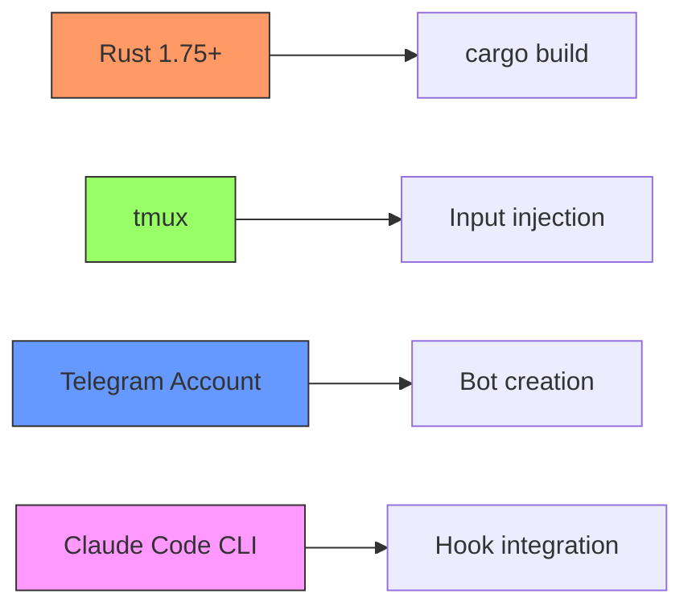
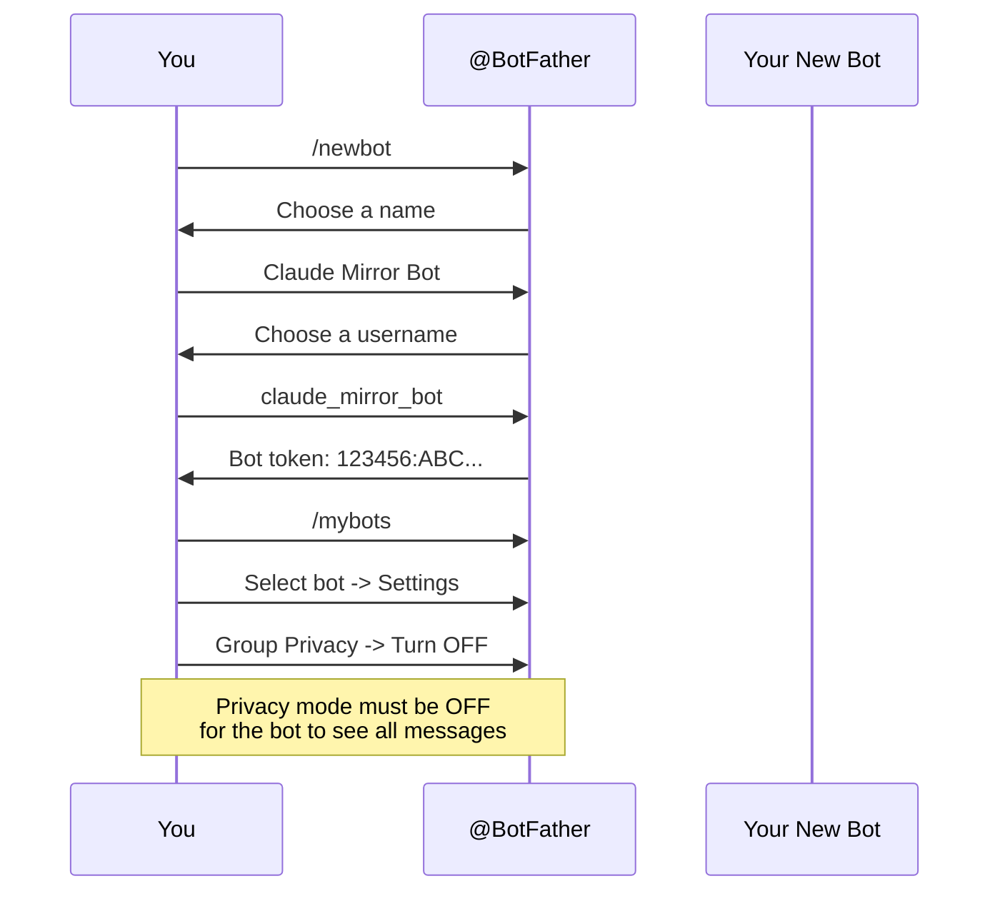
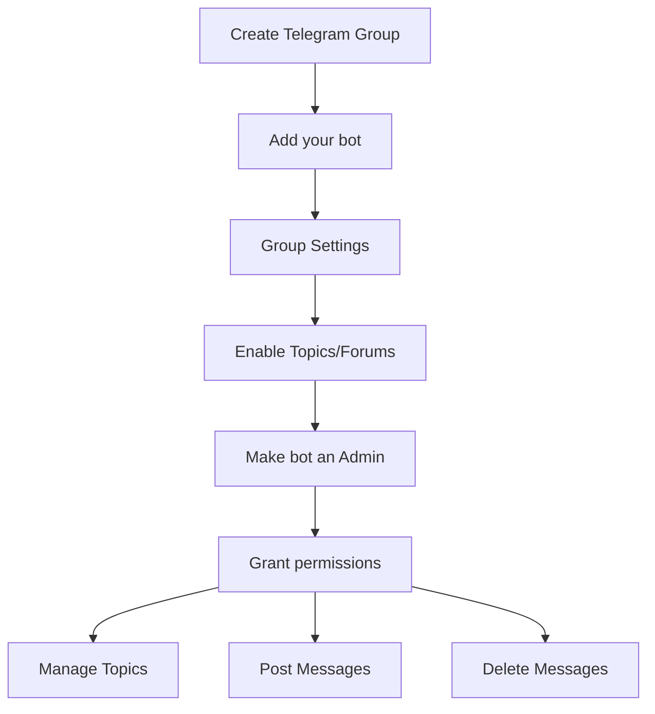
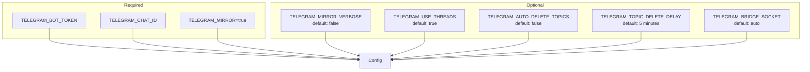
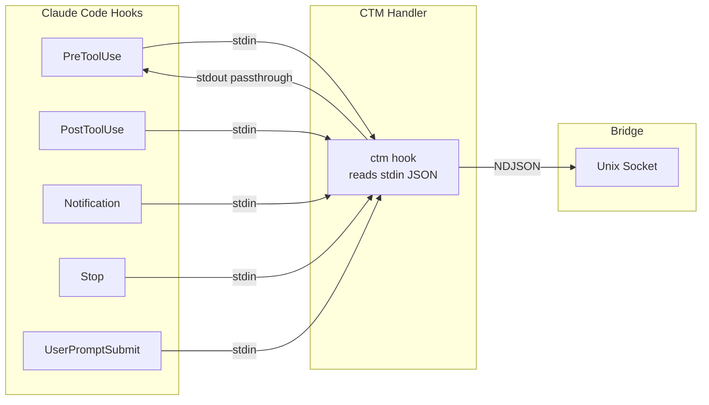
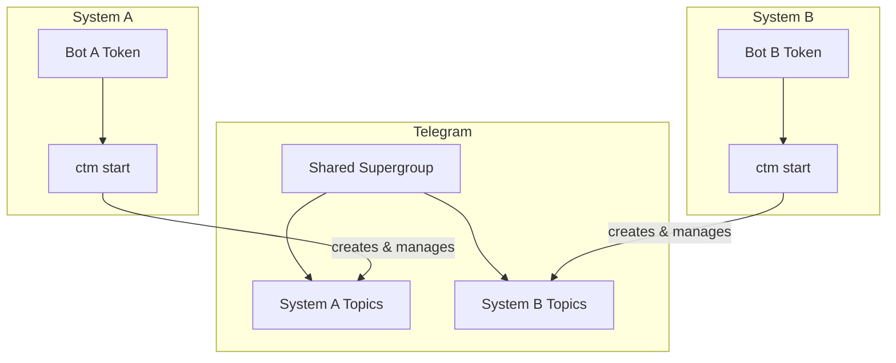

# Setup Guide

Complete guide to setting up Claude Code Rust Telegram (CTM) from scratch.

## Prerequisites



| Requirement | Purpose | Check |
|-------------|---------|-------|
| Rust 1.75+ | Build CTM binary | `rustc --version` |
| tmux | Bidirectional CLI communication | `tmux -V` |
| Claude Code | The CLI being mirrored | `claude --version` |
| Telegram account | Mobile control interface | - |

## Step 1: Build CTM

```bash
git clone https://github.com/DreamLab-AI/Claude-Code-Rust-Telegram.git
cd Claude-Code-Rust-Telegram
cargo build --release
```

The binary is at `target/release/ctm`. Optionally install it:

```bash
cp target/release/ctm ~/.local/bin/
# or
sudo cp target/release/ctm /usr/local/bin/
```

## Step 2: Create a Telegram Bot



1. Open Telegram and message [@BotFather](https://t.me/botfather)
2. Send `/newbot` and follow the prompts
3. Copy the **bot token** (format: `123456789:ABCdefGHIjklMNOpqrsTUVwxyz`)
4. **Disable privacy mode**: `/mybots` -> Select bot -> Bot Settings -> Group Privacy -> **Turn off**

## Step 3: Create a Supergroup with Topics



1. Create a new group in Telegram
2. Add your bot to the group
3. Go to Group Settings -> Enable **Topics**
4. Make the bot an **Administrator** with these permissions:
   - Manage Topics
   - Post Messages
   - Delete Messages (optional, for topic cleanup)

## Step 4: Get Your Chat ID

The chat ID identifies your supergroup. Supergroup IDs start with `-100`.

### Using the helper script

```bash
./scripts/get-chat-id.sh YOUR_BOT_TOKEN
```

### Manual method

1. Send any message in the group
2. Visit: `https://api.telegram.org/botYOUR_TOKEN/getUpdates`
3. Find `"chat": {"id": -100XXXXXXXXXX}` in the response

## Step 5: Configure Environment

Create `~/.telegram-env`:

```bash
export TELEGRAM_BOT_TOKEN="123456789:ABCdefGHIjklMNOpqrsTUVwxyz"
export TELEGRAM_CHAT_ID="-1001234567890"
export TELEGRAM_MIRROR=true
```

Source it in your shell profile (`~/.bashrc` or `~/.zshrc`):

```bash
[[ -f ~/.telegram-env ]] && source ~/.telegram-env
```

### All Configuration Options



| Variable | Required | Default | Description |
|----------|----------|---------|-------------|
| `TELEGRAM_BOT_TOKEN` | Yes | - | Bot API token from @BotFather |
| `TELEGRAM_CHAT_ID` | Yes | - | Supergroup chat ID (starts with -100) |
| `TELEGRAM_MIRROR` | Yes | `false` | Enable the bridge |
| `TELEGRAM_MIRROR_VERBOSE` | No | `false` | Show tool start/result messages |
| `TELEGRAM_USE_THREADS` | No | `true` | Create forum topics per session |
| `TELEGRAM_AUTO_DELETE_TOPICS` | No | `false` | Delete topics when sessions end |
| `TELEGRAM_TOPIC_DELETE_DELAY` | No | `5` | Minutes before topic deletion |
| `TELEGRAM_BRIDGE_SOCKET` | No | auto | Custom socket path |

## Step 6: Install Claude Code Hooks

Add to `~/.claude/settings.json`:

```json
{
  "hooks": {
    "PreToolUse": [{ "command": "ctm hook" }],
    "PostToolUse": [{ "command": "ctm hook" }],
    "Notification": [{ "command": "ctm hook" }],
    "Stop": [{ "command": "ctm hook" }],
    "UserPromptSubmit": [{ "command": "ctm hook" }]
  }
}
```

### Hook Architecture



Each hook:
1. Receives JSON on **stdin** from Claude Code
2. Parses the event and forwards to the bridge via unix socket
3. Passes through the original JSON on **stdout** (so Claude Code is unaffected)

## Step 7: Start the Daemon

```bash
# Start in foreground
ctm start

# Or in a tmux window
tmux new-window -n ctm 'ctm start'
```

## Step 8: Verify

```bash
ctm doctor
```

Expected output:
```
Claude Telegram Mirror - Doctor
================================

[1/6] Binary...
  OK: ctm binary running

[2/6] Config directory...
  OK: Config directory exists with secure permissions

[3/6] Environment variables...
  OK: All environment variables set

[4/6] tmux...
  OK: tmux is available
  OK: tmux session detected: workspace:0.0

[5/6] Socket...
  OK: Bridge socket exists at ~/.config/claude-telegram-mirror/bridge.sock

[6/6] Database...
  OK: Database accessible (0 sessions, 0 approvals)

================================
All checks passed!
```

## Step 9: Use It

```bash
# Start Claude Code in tmux
tmux new -s claude
claude
```

Now any Claude Code activity will be mirrored to your Telegram supergroup. Reply in the forum topic to send input back to Claude.

## Supervisor Integration (Docker/Server)

For running as a managed service:

```ini
[program:ctm]
command=/usr/local/bin/ctm start
directory=/home/devuser
user=devuser
autostart=true
autorestart=true
environment=TELEGRAM_MIRROR="true",RUST_LOG="info"
stdout_logfile=/home/devuser/.config/claude-telegram-mirror/supervisor.log
stdout_logfile_maxbytes=10MB
```

## Multi-System Setup



Each system needs its own bot token (Telegram only allows one polling connection per token). All bots share the same supergroup, and each daemon only manages topics it created.
