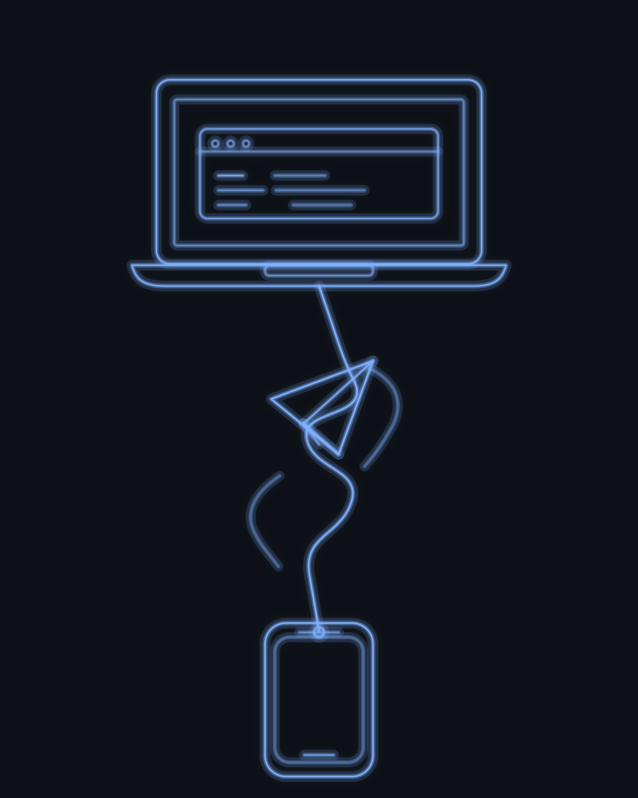
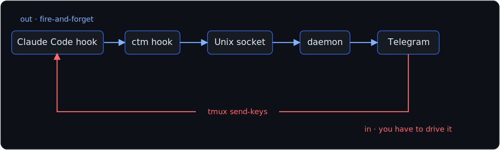
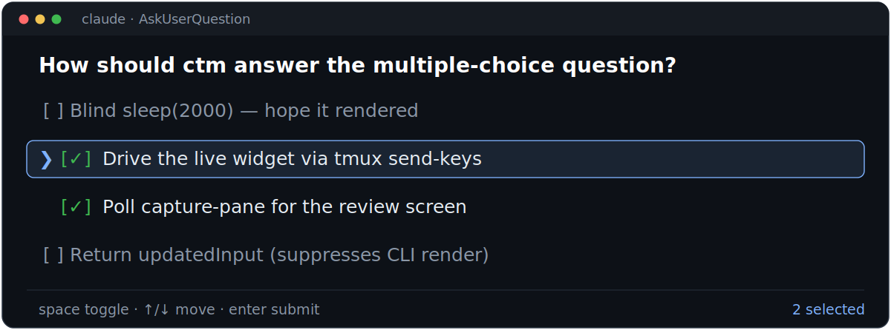

<!-- _class: title -->
<!-- _paginate: false -->
<!-- _footer: "" -->



# The Most Fragile Line of Code

## Controlling an AI Agent From Your Phone

Robert E. Lee
[`github.com/robertelee78/claude-telegram-mirror`](https://github.com/robertelee78/claude-telegram-mirror)
[`linkedin.com/in/robertgpt`](https://www.linkedin.com/in/robertgpt)

---

<!-- Beat 1 — THE FIRE (0:00–0:45). Earnest. Tell the story; the slide is just an anchor. -->

# February. Fourth kid. "Paternity leave."

- An AI agent running on my machine, **mid-task** — the kind you don't leave unsupervised.
- The other room: my wife needs a hand with the baby. **Now.**
- Leave the terminal → an agent runs wild on my code. Stay → I leave her holding the baby.

> All I needed was to *see* what it was doing — and say "yes," or "no, not like that" — **from my phone. As if I were still sitting there.**

<span class="small">In 10 minutes I'll do exactly that, live. First: the line of code that made it possible was, for months, the most fragile in the project.</span>

---

<!-- Beat 2 — WHAT CTM IS + THE INVARIANT (0:45–1:45). Say the invariant slowly. -->

# `ctm` — a Rust bridge: Claude Code ⇄ Telegram



**The whole point isn't two *copies* of the conversation. It's *one* conversation I can touch from either side.**

Desk → walk away → answer on my phone → sit back down and keep typing. Same session, mid-thought. **I never switch contexts. The interface follows me.**

<span class="small">~20,000 lines of Rust · 15 ADRs · ~595 tests · ~6 months.</span>

---

<!-- Beat 3 — THE ASYMMETRY + VILLAIN WIDGET (1:45–2:45). Humor starts. -->
<!-- _footer: "" -->

# Out is easy. *In* is brutal.

- **Out:** the agent fires events — a *hook* (a script Claude runs at lifecycle moments). I forward them. Fire and forget.
- **In:** Claude Code has no "inject the answer" API. It reads a **terminal**. That's the only door.
- A yes/no approval? Fine — the hook can return that. But sometimes it asks a **multiple-choice question**, drawn as an interactive terminal widget — arrow keys and all.

> You can't pipe text at that. You have to *drive* it.



---

<!-- Beat 4 — THE FRAGILE v1 (2:45–3:45). Wry. The title beat. -->

# v1: I pretended to be a human

```rust
let key_delay = Duration::from_millis(300);

for &idx in selected_indices {            // toggle each chosen option
    inj.send_key(&format!("{}", idx + 1));
    sleep(key_delay).await;
}
let downs_needed = total_options + 2;     // walk down to "Submit"
for _ in 0..downs_needed {
    inj.send_key("Down");
    sleep(key_delay).await;
}
inj.send_key("Enter");
```

I built a robot… to hunt-and-peck… for another robot. **~9 keys × 300ms ≈ 2.7s** — then I had to wait for the review screen before pressing Enter. How long does that take? **I had no idea. So I guessed.**

---

<!-- _class: big -->
<!-- _footer: "" -->

# `sleep(2000ms)`

<p>// 2s is enough</p>

<p class="small">~4.7s per answer — riding on a guess. When 2s wasn't enough, I pressed Enter into a screen that hadn't rendered yet, and the answer just… evaporated.</p>

---

<!-- Beat 5 — THE ELEGANT REWRITE / false summit (3:45–4:45). Sell it. -->

# Then: stop typing. Speak the protocol.

- One kind of hook can **block** and hand back structured data.
- So: don't impersonate a user. Intercept the question, collect the answer in Telegram, hand it **straight back as JSON**.
- No terminal. No keystrokes. No `Down, Down, Down`. No guessing how long a screen takes to paint.

That ~4.7-second dance collapsed into building a tiny answer object — **microseconds to assemble.** I ripped out the whole keystroke path.

> It felt *fantastic*. It felt a little **too** clean. Hold that thought.

---

<!-- Beat 6 — THE RUG-PULL (4:45–5:30). The turn. -->

# The fix forced the exact thing it was meant to kill

Handing the answer back as data tells Claude: *"already answered — don't ask."*
So it **stops drawing the question in the terminal at all.**

- The question now lives **only** in Telegram.
- Sitting right at my keyboard? I *can't answer where I am.* I have to stop and pick up my phone.
- I built this so I'd **never** switch interfaces… and the "elegant" version **mandated** one. Every time.

> It didn't just drop a surface. It broke the **seamlessness** — the one continuous conversation — that's the entire reason the thing exists.

---

<!-- Beat 7 — THE REAL FIX (5:30–6:30). Sincere. The thesis. -->

# So I put the keystrokes back — and fixed the line that was *actually* broken

- Injection was never a hack here. It's the **one mechanism that keeps the question on both screens.** It was load-bearing the whole time.
- The broken line wasn't the *layer*. It was the **guess.**

```diff
- sleep(Duration::from_millis(2000));   // 2s is enough  (hope)
+ // read the terminal; press Enter the instant the
+ // review screen is actually there — capture_pane polling
```

**A couple hundred milliseconds** instead of a blind 2-second wait — and it **no longer blind-races** the review screen. The win wasn't a faster constant. It stopped *guessing* and started *checking*.

---

<!-- Beat 8 — LIVE DEMO (6:30–9:30). The both-surfaces proof. -->

<!-- _class: title -->
<!-- _footer: "" -->

# Live: my phone quizzes me

<p style="color:#aab4c5">Laptop terminal + iPhone, side by side.</p>

<p>From the phone: <em style="color:#fff">"ask me a hard multiple-choice trivia question."</em></p>

<p>The question renders in <strong style="color:#7fb2ff">both</strong> — terminal <em style="color:#fff">and</em> phone.
Tap the answer on the phone → the <strong style="color:#7fb2ff">terminal</strong> advances.</p>

<p class="small">[ ASSET: ≤90s side-by-side recording → assets/demo.mp4 — also the stage fallback ]</p>

---

<!-- Beat 9 — TAKEAWAYS (9:30–9:50). Sincere. -->

# Three things I took from this

1. **A fragile line isn't always at the wrong layer — sometimes it's just *unverified*.** Fix the verification before you fix the architecture.

2. **An elegant rewrite can optimize away the product.** Know what a line is load-bearing *for* before you delete it.

3. **"Elegant" and "correct" are different measurements.** The clean version won the benchmark and lost the point. Measure the regression, not just the speedup.

---

<!-- Close (9:50–10:00). Channels footnote + closing line. -->

# One footnote, then I'll stop

> While I was deep in this, Anthropic shipped **Channels** — an official Claude Code → **Telegram** bridge. Good validation, and genuinely good: its live mode even relays **yes/no** approvals to phone *and* terminal at once — first answer wins. Two things it still doesn't do: it never mirrors the **multiple-choice** question (that stays terminal-only), and it tells you to *"run separate sessions"* — one bot, one session. `ctm` puts the multiple-choice question on **both** screens *and* multiplexes every session on the box into its own Telegram topic. The headless shortcut for the hard part? It just **turns the questions off.** I didn't want to give that up.

### The fix was never faster keystrokes.
Sometimes the most fragile line isn't in the wrong place — it just never checked whether the thing it was waiting for had actually happened.

<span class="small">[`github.com/robertelee78/claude-telegram-mirror`](https://github.com/robertelee78/claude-telegram-mirror) · Robert E. Lee · [`linkedin.com/in/robertgpt`](https://www.linkedin.com/in/robertgpt)</span>

---

<!-- HANDOUT / APPENDIX — not presented; for the leave-behind PDF and Q&A. -->
<!-- _class: receipts -->

# Appendix — the receipts

| | |
|---|---|
| **Project** | `claude-telegram-mirror` (`ctm`), ~20,211 lines of Rust (src), 15 ADRs, ~595 tests |
| **v1 (fragile)** | 300ms/key; ~9-key multi-select ≈ 2.7s + a blind `sleep(2000)` "2s is enough" ⇒ ~4.7s/answer, racing the review screen |
| **v2 (false summit, ADR-014 PR-E)** | answer via `updatedInput`; µs to build — *but* `updatedInput` suppresses the CLI render (+ the `tool_start` Telegram signal) → broke both-surfaces |
| **v3 (real fix, ADR-015)** | injection restored; `tmux capture-pane` readiness polling (`READY_POLL_INTERVAL_MS=200`, 25-poll / 5s cap), Enter only on the verified review screen; no blind race |
| **Channels** (research preview, v2.1.80+) | Official Claude Code → Telegram bridge (an MCP plugin spawned over stdio). Live mode **relays `Bash`/`Write`/`Edit` *yes/no* approvals to terminal *and* phone — first-answer-wins** (v2.1.81+) — but does **not** mirror the AskUserQuestion multiple-choice widget (terminal-only), and the docs say *"to process independent event streams concurrently, run separate sessions"* (one bot ≈ one session). Headless `-p`: *"tools that need terminal input, such as multiple-choice questions and plan mode approval, are disabled so the session never stalls."* |

<span class="small">ADR-014 → ADR-015 (supersedes PR-E) in `docs/adr/`. Claude Code render-suppression contract: anthropics/claude-code #29547. Channels: `code.claude.com/docs/en/channels-reference`.</span>
